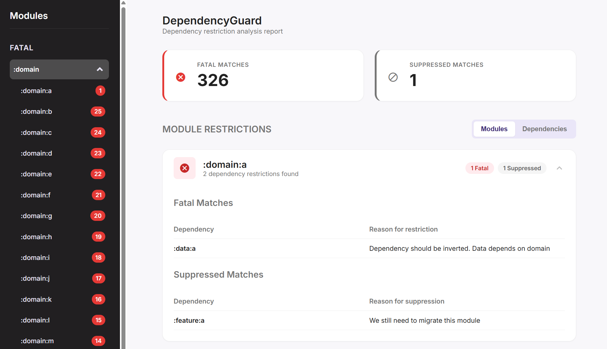

# DependencyGuard

A Gradle plugin that acts as a powerful gatekeeper for your project's dependencies. It helps you enforce architectural rules, prevent unwanted dependencies, and keep your module graph clean and maintainable as your project scales.



## Why DependencyGuard?

As projects grow, so does the complexity of their module graph. Without clear rules, you can accidentally introduce dependencies that violate your app's architecture or agreed conventions:

- A `:domain` module might depend on another `:legacy` module, making it hard to fully switch away from tech debt.
- An `:impl` module might depend on another `:impl` module, instead of an `:api` or `:domain` one.
- A third-party dependency your team agreed to migrate away from might be added by mistake to a new module.

DependencyGuard protects your project's architecture by enforcing dependency rules that can be checked automatically in your CI/CD setup.

## Key Features

- **Simple DSL:** Configure all your rules in a single block in your gradle configuration
- **Control external libraries:** Leverage Gradle's version catalogs (`libs`) for compile-time safety and IDE autocompletion.
- **Dependency usage reports:** Generate a detailed HTML report that clearly shows all dependency violations, making them easy to identify and fix.
- **CI/CD Integration:** Fail your build when a rule is violated, ensuring that no problematic dependencies make it into your main branch.
- **Baseline Support:** Don't want to fix all existing violations at once? Create a baseline file to ignore them and focus on preventing new issues.

## Setup

1. **Add the following to your `versions.toml`**:

    ```
    [plugins]
    dependencyguard = { id = "com.rubensousa.dependencyguard", version = "1.0.0-alpha04" }
    ```


2. **Add the plugin to your root `build.gradle.kts`:**

    ```kotlin
    // Top-level build.gradle.kts
    plugins {
        alias(libs.plugins.dependencyguard) apply true
    }
    ```

2.  **Configure your dependency rules:**

    ```kotlin
    dependencyGuard {
        // Your configuration goes here. See the examples below!
    }
    ```

## How-to

### `guard`

Denies a set of dependencies for any module that matches the provided path.

```kotlin
dependencyGuard {
    // Deny any module in the `:data` layer from depending on any module in the `:legacy` layer.
    guard(":data") {
        deny(":legacy")
    }

    // You can also deny specific dependencies from version catalogs
    guard(":domain") {
        deny(libs.androidx.compose)
    }
}
```

### `restrictModule`

Prevents all dependencies in a module except the ones in the allow list.

```kotlin
dependencyGuard {
    // Domain modules should only depend on other domain modules and specific libraries.
    restrictModule(":domain") {
        reason("Domain modules have restricted dependencies")
        allow(":domain") // Allow depending on other :domain modules
        allow(libs.junit) // Allow JUnit for testing
    }
}
```

### `restrictDependency`

Restricts which modules are allowed to depend on a specific dependency. 
This is useful for preventing the use of specific libraries in new modules.

```kotlin
dependencyGuard {
    // Only allow legacy modules to depend on other legacy modules.
    restrictDependency(":legacy") {
        reason("Legacy modules should no longer be used in new code.")
        allow(":legacy")
    }

    // Prevent the use of Mockk in favor of fakes, with a few exceptions.
    restrictDependency(libs.mockk) {
        reason("Fakes should be used instead of mocks.")
        allow(":feature:a") // This feature requires mockk to test platform code.
    }
}
```

### Rules

You can re-use a set of rules across multiple configurations:

```kotlin
dependencyGuard {
    val legacyConsumers = restrictDependencyRule {
        allow(":legacy")
        allow(":old-feature")
    }
    restrictDependency(":legacy") {
        applyRule(legacyConsumers)
    }
    restrictDependency(libs.mockk) {
        applyRule(legacyConsumers)
    }
}
```

## Tasks

-   `./gradlew dependencyGuardCheck`: Runs the dependency analysis on all modules and generates a html report.
-   `./gradlew dependencyGuardBaseline`: Creates a `dependencyguard-baseline.yml` file with all current restrictions. This allows you to start enforcing rules on new code without having to fix all existing issues first.

## License

    Copyright 2026 Rúben Sousa
    
    Licensed under the Apache License, Version 2.0 (the "License");
    you may not use this file except in compliance with the License.
    You may obtain a copy of the License at
    
        http://www.apache.org/licenses/LICENSE-2.0
    
    Unless required by applicable law or agreed to in writing, software
    distributed under the License is distributed on an "AS IS" BASIS,
    WITHOUT WARRANTIES OR CONDITIONS OF ANY KIND, either express or implied.
    See the License for the specific language governing permissions and
    limitations under the License.
