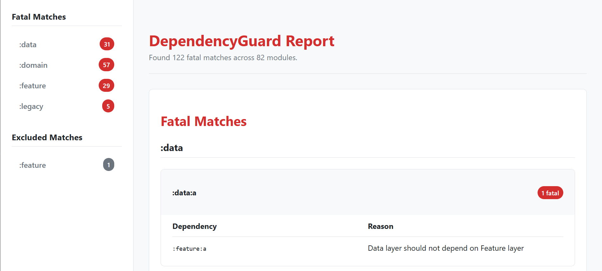

# DependencyGuard

Protect your project against undesired dependencies across different modules.



## Why DependencyGuard?

As projects grow, so does the complexity of their module graph. Without clear rules, you can accidentally introduce dependencies that violate your app's architecture or agreed conventions:
- A `:domain` module might depend on another `:legacy` module, making it hard to fully switch away from tech debt.
- A `:impl` module might depend on another `:impl` module, instead of an `:api` or `:domain` one.
- A third-party dependency your team agreed to migrate away from might be added by mistake to a new module

DependencyGuard protects your project's architecture by enforcing dependency rules that can be checked automatically in your CI/CD setup

## Setup

1. Add the following to your versions.toml:

```
[plugins]
dependencyguard = { id = "com.rubensousa.dependencyguard", version = "1.0.0-alpha01" }
```

2. Apply the plugin in your root `build.gradle.kts` and all of the subprojects:

```kotlin
plugins {
    alias(libs.plugins.dependencyguard) apply true
}

dependencyGuard {
    // Global configuration. See below for examples
}
```

Or if you're still using groovy:

```groovy
plugins {
    alias libs.plugins.dependencyguard apply true
}

dependencyGuard {
    // Global configuration. See below for examples
}
```

## Features

1. Define dependencies that can't be used for some modules


```kotlin
dependencyGuard {
    /**
     * This matches all modules within the domain directory.
     * E.g (":domain:a", ":domain:b", ":domain:c")
     */
    guard(":domain") {
        /**
         * This matches all modules within the legacy directory.
         * E.g (":legacy:a", ":legacy:b", ":legacy:c")
         */
        deny(":legacy")
    }
}
```

2. Forbid external third-party dependencies depending on the use case

```kotlin
dependencyGuard {
    restrictDependency(libs.mockk) {
        setReason("Mocks should not be used unless really needed")
        allow(":platform") {
            setReason("Platform modules require mockk for some cases")
        }
    }
}
```

3. Suppress rules temporarily with `./gradlew dependencyGuardBaseline`. This will create a `dependencyguard.yml` that contains the existing violations

4. Run `./gradlew dependencyGuardCheck` to validate the project using the rules you configured

5. Run `./gradlew dependencyGuardHtmlReport` task to generate a HTML report with the violations affected by this project, including the ones that are ignored


## License

    Copyright 2026 Rúben Sousa
    
    Licensed under the Apache License, Version 2.0 (the "License");
    you may not use this file except in compliance with the License.
    You may obtain a copy of the License at
    
        http://www.apache.org/licenses/LICENSE-2.0
    
    Unless required by applicable law or agreed to in writing, software
    distributed under the License is distributed on an "AS IS" BASIS,
    WITHOUT WARRANTIES OR CONDITIONS OF ANY KIND, either express or implied.
    See the License for the specific language governing permissions and
    limitations under the License.